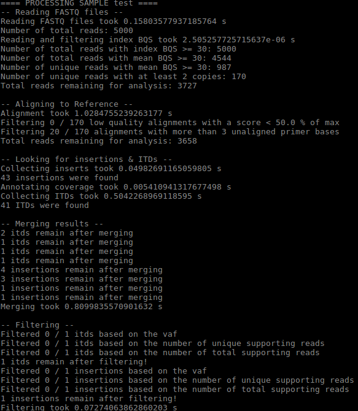

# getITD
version  
link to future paper

## Author / Support
T.J. Blätte  
tamara.blaette@uni-ulm.de

## Requirements
python3
- pandas
- numpy
- biopython

## Installation (Linux / Ubuntu)
```
pip install numpy pandas biopython
```

## Input
###### Required:
- Fastq files to process
- Sample ID / Output folder prefix  

###### Optional:
-
-
-

For a complete list of available commandline arguments, run
```
python3 getitd.py --help
```

## Output 
##### Files
For each sample, an output directory will be created in the current directory, named using the provided Sample ID / Output folder prefix.
Inside, all generated output files reside:
- config.tsv contains parameters, date and time of the analysis
- out\_needle/ contains individual alignment files, needle\_\*.txt, of all the different reads processed
- itds\_collapsed-is-same\_is-similar\_is-close\_is-same-trailing\_hc.tsv contains filtered high-confidence (hc) ITDs, fully merged
- itds\_collapsed-is-same\_is-similar\_is-close\_is-same-trailing.tsv contains all ITDs, fully merged
- itds\_collapsed-is-same\_is-similar\_is-close.tsv contains all ITDs, having merged those of the same length with identical or similar tandem sequences and close start coordinates (within one tandem length)
- itds\_collapsed-is-same\_is-similar.tsv contains all ITDs, having merged those of the same length and tandem sequence
- itds\_collapsed-is-same.tsv contains all ITDs, having merged those that share the same length, tandem sequence and start coordinates
- insertions\*.tsv files are analogous to ITD files but list all insertions, regardless of whether these are also ITDs or not

##### On stdout
At each filtering step, the number of reads and insertions passing the specified requirements are printed.   
Currently, also the computation time of various steps is printed, but presumably this will change in the future. 

## Example
Start analysis of provided example test files:
```
cd test
python3 ../getitd.py test_R1.fastq test_R2.fastq test
```

Expected output:  


## How it works
1. Read in FASTQ files
    - Read in forward reads and BQS (R1)
    - Read in and reverse complement reverse reads and BQS (R2)
    - from now on, treat all as forward reads
2. Filter reads for minimum average base quality score (BQS)
    - Discard reads that do not pass this filter
3. Filter unique reads
    - Discard reads present only once  
    - Assumption: true / clinically relevant sequences will be there at least twice
4. Align each read to the WT amplicon reference sequence
    - Uses Needlemann-Wunsch alignment algorithm
5. Filter alignments, require
    - at least 50 % of the maximum possible alignment score
    - error-free alignment to primer sequence
6. Collect insertions within passing reads, require
    - insert length of at least 6 bp
    - in-frame insert (length divisible by 3)
    - absence of ambiguous "N" bases within the actual insert sequence
    - 3' or 5' trailing inserts not fully spanned by the sequenced reads are not required to be in-frame, since their exact length is not actually known
7. Collect ITDs within passing insertions, require
    - insert sequence can be realigned to WT amplicon sequence, again with at least 50 % of the maximum possible alignment score
8. Merge insertions and ITDs independently (considering reads to describe the same event and adding up supporting counts), require
    - that they are actually the same: insert length, coordinates and sequence are identical
    - that they are similar: insert length and coordinates are the same, sequences are similar
    - that they are close: insert length is the same, sequences are similar and coordinates are within one insert length of each other
    - close trailing inserts are considered the same regardless of their (estimated) length
9. Filter insertions and ITDs independently, require
    - at least two different supporting reads
    - a minimum variant allele frequency (VAF) of 0.001 %
